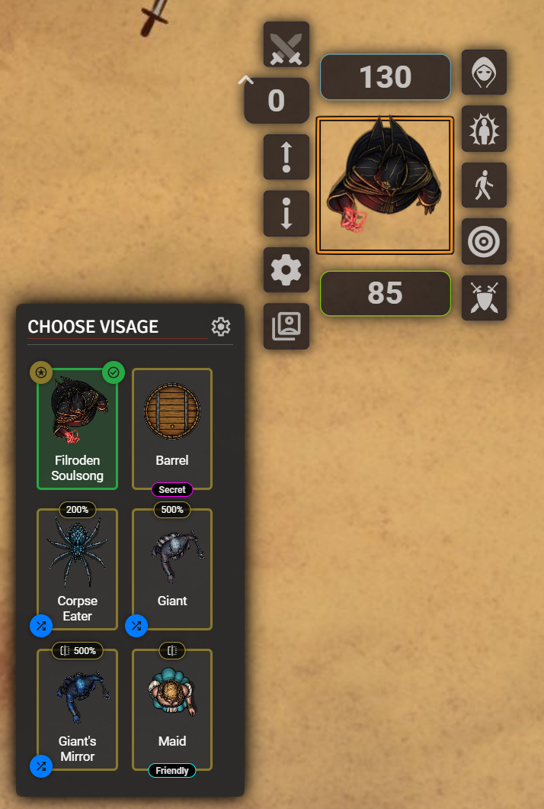

# Visage

Allows the owner of an Actor to instantly switch a Token's image, name, scale, flip state, and mechanical disposition between multiple pre-defined visages via a custom, grid-based selector in the Token HUD.

Software and associated documentation files in this repository are covered by an [MIT License](LICENSE.md).

| Version | Changes |
| :--- | :--- |
| **Version 0.5.0** | * Add feature to configure and apply token disposition (Friendly, Neutral, Hostile, Secret) with each visage, enabling disguise and illusion mechanics.<br>* Update styling for configuration window and selector HUD chip.<br>* Update documentation<br>* Small styling changes to Visage Configuration window |
| **Version 0.4.0** | * Significant re-write<br>* Move the token configuration from the default token window where there was a rendering issue, to its own window, opened by clicking a setting cog in the Visage Selector HUD<br>* Add styling to the "Save Changes" button if there are changes to be saved<br>* Match the new config window style to the Selector HUD style<br>* Sort Visage forms in the Selector HUD in alphabetical order with the default always first<br>* Add shuffle icon on any visage form that uses a wildcard within its filepath to show user they can select it again for a different random pick |
| **Version 0.3.4** | Fix flip option for token images |
| **Version 0.3.3** | * Fix bug when restoring scale to default (again)<br>* Fix how wildcard paths are resolved to prevent the mystery man appearing |
| **Version 0.3.2** | Fix bug when restoring scale to default |
| **Version 0.3.1** | Fix label in configuration tab |
| **Version 0.3.0** | Add a token image scaling feature, including option to flip the image |
| **Version 0.2.4** | * Add module setting to remove visage data from tokens<br>* Add star icon to default token tile in selector HUD<br>* Add usage instructions to the README.md |
| **Version 0.2.3** | * Under the covers code improvement<br>* Improvements made to visage token configuration |
| **Version 0.2.1** | Fix issue with reading data from tokens that were not linked to actors |
| **Version 0.2.0** | Initial build |

## How to Use Visage

Visage makes it easy to switch a token's appearance, name, and mechanical state on the fly. Here’s how to set it up and use it.

### 1. Configuring Visages

Before you can switch visages, you need to define them for a token.

1. **Open Visage Configuration**: Right-click on a token and choose the new Visage icon in the Token HUD (a "switch account" symbol) to open the Visage Selector HUD. In the top right corner, click the settings ("cog") icon to open the Visage Configuration window.
2. **Review Visage Defaults**:
    * The Visage Configuration window shows the token's current default name and image path. These are the settings the token will have when its visage is set to "Default". **Note**: The token's *default disposition* is also captured automatically but not displayed here.
    * By default, these are inherited from the actor's main settings. However, you can override them by changing the token name/image/disposition on the Token's main configuration window. Visage automatically tracks these changes.
3. **Add Alternate Visages**:
    * Click the "**Add Visage**" button to create a new alternate form.
    * For each alternate visage, you must provide:
        * **Name**: A name for the visage (e.g., "Wolf Form", "Disguised", "Wounded", "Barrel"). This name will also be used for the token's name when this visage is active so remember this is what other players will see.
        * **Image Path**: The path to the image file for this visage. You can use the folder icon to open the File Picker. Wildcards (`*`) are supported to select a random image from a folder, e.g., 'path/to/images/wolf_*.webp'.
        * **Scale**: A percentage scale factor (e.g., `100%`, `80%`, `150%`). This will visually enlarge or shrink the token image on the canvas without changing its actual grid size. The default is `100%` (no change).
        * **Flip**: If ticked, the image will be flipped horizontally.
        * **Disposition**: Controls the token's mechanical state (border color and interactability) when this visage is active. Next to the Flip checkbox, there's a **Disposition** button showing the current setting (e.g., 'Default', 'Disguise: Friendly', 'Illusion: Secret').
            * Clicking this button opens a pop-out where you can choose one of the following overrides:
                * **Default (No Change)**: The visage won't affect the token's disposition. It will keep whatever disposition the token currently has or revert to its original default if switching back to the "Default" visage.
                * **Disguise As**: Select **Friendly**, **Neutral**, or **Hostile**. This changes the token's border color and how other actors/systems might perceive it.
                * **Illusion (Secret)**: Sets the token to the **Secret** state (purple border for owner, non-interactive for others). This is mutually exclusive with Friendly/Neutral/Hostile.
    * These alternate visages are stored on the actor and are available to all tokens of that actor.
4. **Delete Alternative Visages**: Click the trash can next to delete the alternative visage.
5. **Save Changes**: If you make any changes (add new visage form, change a value in an existing form, or delete a form), the "Save Changes" button will highlight. Clicking it will save the changes and close the Visage Configuration window.


### 2. Selecting a Visage

Once configured, switching between visages is simple.

1. **Open the Token HUD**: Click on a token you have configured to bring up the Token HUD.
2. **Click the Visage Icon**: You will see a new icon (a "switch account" symbol). Click this to open the Visage Selector.
3. **Choose a Visage**: A grid will appear next to the token showing all the available Visages you configured:
    * The token's specific "Default" look has a gold star icon in the top left corner.
    * The currently active visage is highlighted with a green check icon in the top right corner.
    * If a Visage has a scale that is not 100% or it has flip enabled, these will be shown in a **chip** on the top border.
    * If a Visage uses a wildcard in its filepath, it will show a blue shuffle icon in the bottom left corner. Selecting it again will pick another random image.
    * If a visage changes the token's disposition, a colored **chip** will appear at the bottom-center indicating the state (e.g., 'Friendly', 'Hostile', 'Secret'), matching Foundry's disposition colors.
4. **Click to Switch**: Simply click on any of the Visages in the grid. The token's image, name, scale, flip, and disposition will instantly update to match your selection, and the selector will close.



### 3. Restoring the Default

To switch a token back to its original appearance:

1. Open the Visage Selector from the Token HUD.
2. Click on the Default tile (marked with a gold star in the top left corner).
3. The token will revert to the default name, image, scale, flip state, and disposition that Visage automatically captured for it.

### 4. Deleting all visage-related data

For GMs, the module offers two settings that will remove all visage-related data from either all tokens on a scene or from all tokens on all scenes. Use this with caution as it cannot be undone.

## Visage Module: Public API Documentation

The **Visage** module exposes a public API that allows other modules, system macros, or advanced users to programmatically interact with its core functionality, such as switching actor forms.

The API is accessible via `game.modules.get('visage').api`.

-----

### Accessing the API

To access any of the functions described below, you must first get a reference to the API object:

```javascript
const visageAPI = game.modules.get('visage')?.api;

if (!visageAPI) {
    console.error("Visage API is not available.");
    return;
}
// Now you can call the functions, e.g., visageAPI.setVisage(...)
````

-----

### API Methods

#### 1\. setVisage

The core function to switch the specified Token to the specified appearance form and apply its configured overrides.

| Parameter | Type     | Description                                                                                                                                                                                |
| :-------- | :------- | :----------------------------------------------------------------------------------------------------------------------------------------------------------------------------------------- |
| `actorId` | `string` | The ID of the Actor document associated with the token.                                                                                                                                    |
| `tokenId` | `string` | The ID of a specific Token on the canvas to update immediately.                                                                                                                            |
| `formKey` | `string` | The key of the appearance form to switch to (e.g., "Wolf Form"). Use the string literal `"default"` to switch to the Token's captured default image, name, scale, and disposition. |

**Signature:**

```typescript
(actorId: string, tokenId: string, formKey: string): Promise<boolean>
```

**Returns:**

* `Promise<true>` on success.
* `Promise<false>` if the Actor, Token, or the specified `formKey` is not found, or if the update fails.

**Details:**

This function updates the token's `name`, `texture.src`, `texture.scaleX`, `texture.scaleY`, **and `disposition`** based on the data saved for the specified `formKey`. If the `formKey` is `"default"`, it restores the values captured automatically by Visage. If the configured disposition for the form is set to "Default (No Change)" (`null` internally), the token's disposition will *not* be modified by this call when switching to that form.

**Example: Switch a specific token to a 'Wolf' form**

```javascript
visageAPI.setVisage("actor-id-12345", "token-id-67890", "Wolf");
```

#### 2\. getForms

Retrieves a standardized array of all available alternate visages for a given Actor.

| Parameter | Type     | Description                          |
| :-------- | :------- | :----------------------------------- |
| `actorId` | `string` | The ID of the Actor document to query. |

**Signature:**

```typescript
(actorId: string): Array<object> | null
```

**Returns:**

* An `Array` of visage objects, where each object has the following structure:
  * `key` (string): The internal key (name) for the visage.
  * `name` (string): The display name of the visage (currently same as key).
  * `path` (string): The image file path for the visage.
  * `scale` (number): The configured scale factor for the visage (e.g., `1.0`, `1.2`, `-0.8`).
  * **`disposition` (number | null)**: The configured disposition override value (`1`: Friendly, `0`: Neutral, `-1`: Hostile, `-2`: Secret) or `null` if the visage is set to "Default (No Change)".
* Returns `null` if no alternate forms are defined or the Actor is not found.

**Example:**

```javascript
const forms = visageAPI.getForms("actor-id-12345");
// forms might look like:
// [
//   { key: "Wolf", name: "Wolf", path: "path/to/wolf.webp", scale: 1.2, disposition: -1 }, // Hostile wolf
//   { key: "Disguise", name: "Disguise", path: "path/to/mask.webp", scale: 1.0, disposition: 1 }, // Friendly disguise
//   { key: "Illusion", name: "Illusion", path: "path/to/illusion.webp", scale: 1.0, disposition: -2 }, // Secret illusion
//   { key: "Wounded", name: "Wounded", path: "path/to/wounded.webp", scale: 1.0, disposition: null } // No disposition change
// ]
```

#### 3\. isFormActive

Checks if the specified appearance form is currently active on a specific Token.

| Parameter | Type     | Description                                                                 |
| :-------- | :------- | :-------------------------------------------------------------------------- |
| `actorId` | `string` | The ID of the Actor document associated with the token.                     |
| `tokenId` | `string` | The ID of the token on the canvas to check.                                 |
| `formKey` | `string` | The key of the appearance form to check (e.g., `"default"`, `"Wolf"`). |

**Signature:**

```typescript
(actorId: string, tokenId: string, formKey: string): boolean
```

**Returns:**

* `true` if the token's currently applied form key matches the one provided, otherwise `false`.

**Example:**

```javascript
if (visageAPI.isFormActive("actor-id-12345", "token-id-67890", "default")) {
    console.log("The token is in its default form.");
}
```

#### 4\. resolvePath

A utility function to resolve a file path that may contain a Foundry VTT wildcard (`*`) into a single, concrete image path. This is primarily used for displaying a single image in UI previews.

| Parameter | Type     | Description                                |
| :-------- | :------- | :----------------------------------------- |
| `path`    | `string` | The file path (which may include a wildcard). |

**Signature:**

```typescript
(path: string): Promise<string>
```

**Returns:**

* A `Promise` that resolves to the concrete file path. If the path does not contain a wildcard, the original path is returned. If resolution fails (e.g., no matching files), the original path is returned as a fallback.

**Example:**

```javascript
const wildcardPath = "path/to/images/*.webp";
const resolved = await visageAPI.resolvePath(wildcardPath);
// resolved might be: "path/to/images/wolf-03.webp"
```

-----

## Note on Token vs. Actor IDs

The Visage API methods generally require both an `actorId` and a `tokenId` because the custom visage configurations are stored on the **Actor Document**, but the visual changes (image, name, scale, **disposition**) must be applied to the specific **Token Document** on the canvas. The currently active form is also tracked per-token.

You can reliably get both IDs from any selected Token instance (`token`) on the canvas using:

```javascript
const tokenId = token.id;
const actorId = token.actor.id; // Works for both linked and unlinked tokens
```
